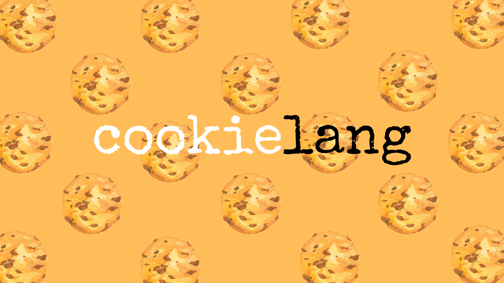

**`cookielang`** is a custom programming language and compiler built natively using python.

-   `cookielang` uses `RPLY` as its lexer and parser, and `LLVMlite` as low level intermediate language to do code generation with custom general optimizations.
-   `EBNF` (Extended Backus-Naur Form) grammar is used to parse the source code and specify the semantics of the language.
-   I used the `LLVM IR` to compile our `TOY` programs. Using LLVM, it is possible to optimize your compilation without learning compiling optimization, and LLVM has a really good library to work with compilers.
